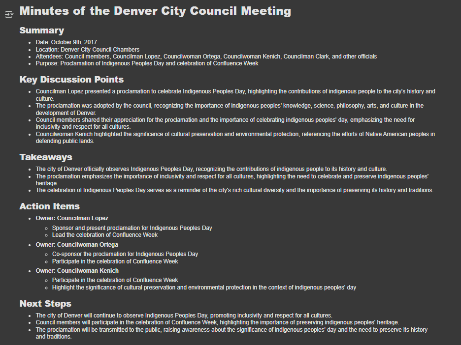

# 📝 Meeting Minutes Generator from Audio

This project automates the process of creating professional meeting minutes from audio recordings.  
It uses **Whisper** for speech-to-text transcription and **LLaMA** for summarizing and structuring the output in Markdown format.

## Features
- 🎙 **Audio Transcription** – Converts meeting audio into accurate text.
- 🧠 **AI-Powered Summarization** – Extracts summaries, key points, takeaways, and action items.
- 📄 **Markdown Output** – Generates clean, shareable meeting notes.
- 🔗 **Google Drive Integration** – Load audio directly from your Drive in Colab.

---
---

## 📌 Output

---

